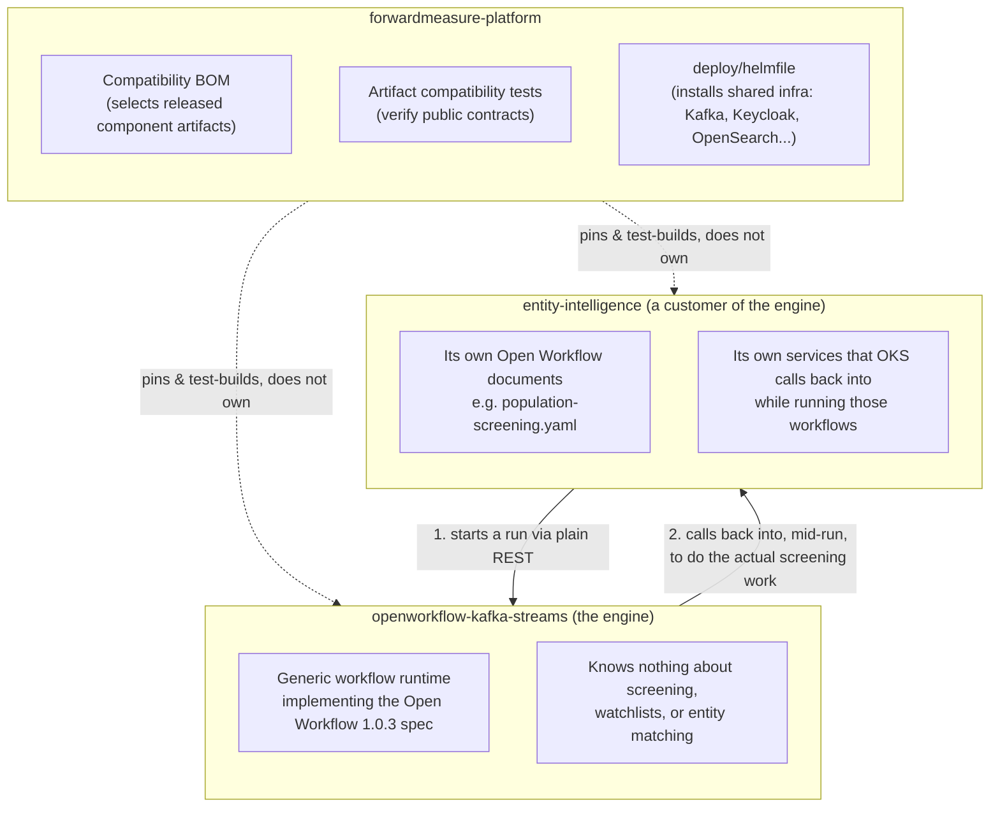
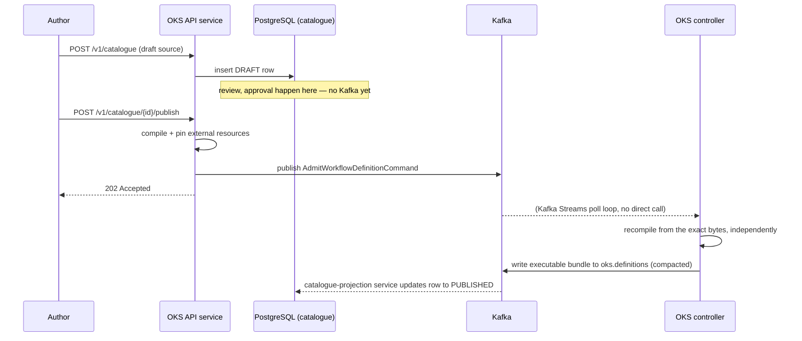
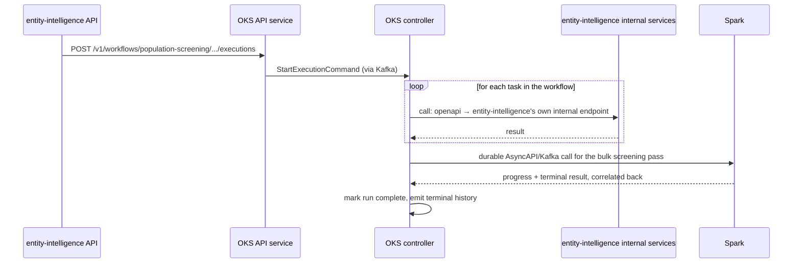

# How the Platform Fits Together: OKS, Entity Intelligence, and the Umbrella Repo

> Historical note (2026-08-14): implementation details in this document were
> derived from the rejected `entity-intelligence` repository. That repository
> is throwaway reference material, not the baseline for the replacement at
> `forwardmeasure-entity-intelligence`. The product boundaries remain valid;
> concrete Entity Intelligence module and workflow details require revalidation
> against the replacement implementation.

> **Stale, 2026-08-30: this document describes a pre-unification, single-engine
> architecture that no longer matches reality, not just an outdated repo name.**
> The standalone `openworkflow-kafka-streams` (OKS) repo it treats as "the engine"
> throughout has been retired — that capability, and the separate standalone
> `openworkflow-actor-engine` repo, now both live inside one unified repo,
> `forwardmeasure-openworkflow`, which offers **two pluggable execution engines**
> (Kafka-Streams and Pekko/actor-based) behind one shared REST facade — a fact this
> document doesn't mention anywhere, since it predates that design. Module names cited
> below (`oks-controller-service`, `oks-catalogue-quarkus`, `oks-agent-a2a-service`, etc.)
> are the old standalone repo's internal names and have not been re-verified against
> `forwardmeasure-openworkflow`'s current module structure; treat every specific
> class/module/topic name below as unverified until checked against the current repo.
> The high-level product-boundary framing (platform repo = release train, not a
> monorepo; Entity Intelligence = a customer workflow author, not a second execution
> engine) is still directionally correct. For the current, accurate picture of the
> engine itself, start from `forwardmeasure-openworkflow/docs/` (see especially
> `docs/operations.md` for deployment profiles and `docs/engine-construct-gap-audit.md`
> for what each of the two engines actually supports today) rather than this document
> or anything inside the now-retired `openworkflow-kafka-streams` repo. This document
> needs a real rewrite against the unified repo, not a patch — flagging rather than
> guessing at that rewrite.

*A gentle guide for someone who knows the code exists but not yet how it works.*

*Written 2026-08-09. Grounded in the current source of `forwardmeasure-platform`, `openworkflow-kafka-streams`, `forwardmeasure-jpa`, and `entity-intelligence`. Where the codebase is honestly incomplete or has changed recently, this document says so rather than papering over it.*

---

## How to read this

This document answers a specific list of questions, in order, using plain language first and precise mechanism second. Every non-obvious claim is grounded in a real file so you (or I) can go verify it later. There is also a much more detailed, code-level companion document already in the OKS repository — `openworkflow-kafka-streams/docs/how-oks-executes-a-workflow.html` — which this document leans on for the deepest runtime mechanics and points you to explicitly rather than silently repeating everything in it.

If you read nothing else, read section 1 (the big picture) and section 7 (the runtime model) — those two answer most of what you asked.

---

## 1. The big picture: three repositories, one platform

You have three checked-out repositories that matter here, and they play three genuinely different roles. It's worth being precise about this because the natural assumption — "the platform repo builds/contains the other two" — is wrong.

- **`openworkflow-kafka-streams` (OKS)** is a general-purpose **workflow engine**. It knows nothing about entity screening, watchlists, or your business. It implements a public specification called Open Workflow 1.0.3 — think of it as "a standard shape for describing a business process as steps," similar in spirit to how HTML is a standard shape for describing a web page. OKS's job is: accept a workflow written in that standard shape, run it reliably, and let you watch and control it.

- **`entity-intelligence`** is a **business application** — entity screening and matching (checking names against watchlists, resolving duplicate identities, and so on). It is a *customer* of OKS: it writes its own workflow documents (in the Open Workflow shape) describing its business processes, and asks OKS to run them.

- **`forwardmeasure-platform`** is neither of those. It does not contain the source code of either. It is a **compatibility release train**, not a monorepo: its BOM selects released component artifacts and its compatibility module tests their public contracts without compiling sibling repositories. Its dashboard provides the cross-component view, while `deploy/helmfile/` installs shared infrastructure such as Kafka, Keycloak, and OpenSearch.

So: **OKS is the engine. Entity Intelligence is a car built to run on that engine. The platform repo is the test track and the parts catalogue — it doesn't build the car or the engine.**



One more useful sentence, taken directly from the platform repo's own UI architecture notes: *"An agent invocation is an OKS execution... [the Entity Intelligence UI] must not create a second workflow runtime model"* (`forwardmeasure-platform/docs/ui-architecture.md`). In other words, even the product-specific "Agents" experience you might see in a dashboard is not a separate execution engine — it's a view onto an OKS run.

---

## 2. What OKS actually is, in one paragraph

Forget "microservice" or "workflow engine" as abstract words for a moment. Concretely: OKS is a small number of shared Kubernetes services (not one per workflow, not one per customer) that all speak to each other exclusively through Apache Kafka. One of those services — the **controller** — holds a very disciplined little program in memory: given "here is the current state of one workflow run, and here is the next thing that happened," it computes "here is the new state, here is what should be recorded in history, and here is what work (if any) needs to happen outside of me." That program never talks to the network, a database, or the filesystem directly. It is deliberately boring and mechanical, because that's what lets it be *durable* — if its pod is killed mid-run, a replacement pod can reconstruct the exact same state from Kafka and carry on as if nothing happened.

Everything that actually *does* something in the outside world — calling an HTTP API, waiting on a timer, running a container — is handled by a different service (an **adapter**), which reports back to the controller through Kafka once it's done. The controller never blocks waiting for that; it just moves on to other runs and reacts when the answer arrives.

---

## 3. How a workflow is defined, validated, and persisted

A workflow's life has two very different phases, and it's easy to conflate them. Keep them separate in your head:

**Phase A — Authoring (lives in PostgreSQL, mutable, in-progress).** Someone writes a workflow document (YAML or JSON, following the Open Workflow shape) and submits it via `POST /v1/catalogue`. This creates a row in Postgres with status `DRAFT`. Nothing has reached Kafka yet — a draft is just a database row that can still be edited, reviewed, rejected, and thrown away. It goes through a governed lifecycle:

```
DRAFT → IN_REVIEW → APPROVED → PUBLISHING → PUBLISHED
                                          ↘ PUBLICATION_REJECTED
```

A different person (a different "actor," see section 4) must approve a draft than the one who wrote it — the code enforces this explicitly (`WorkflowCatalogueTransactions`, `oks-catalogue-quarkus`). Later stages exist too: `DEPRECATED` and `ARCHIVED`, for retiring an old version without executing it again.

**Phase B — Publication (crosses into Kafka, becomes immutable, becomes runnable).** Only when an authorized person calls `POST /v1/catalogue/{id}/publish` does anything happen in Kafka. At that point:

1. The API service compiles the document (checks it against the pinned Open Workflow 1.0.3 schema, resolves and pins any external resources it references — an OpenAPI spec, a JSON Schema, and so on) and publishes **one Kafka record** describing the definition.
2. The controller — completely independently, inside its own Kafka Streams processing loop, not because any HTTP call told it to — reads that record and **recompiles the workflow itself from scratch**, from the exact bytes in the Kafka record. This is not redundant paranoia by accident; it means a corrupted, forged, or stale Kafka record can never quietly become runnable just because the API service said so once. Only the controller's own successful recompilation creates the thing that can actually be executed (`OksDefinitionAdmissionProcessor`, `openworkflow-kafka-streams/oks-runtime-kafka-streams`).
3. If that succeeds, the controller writes the result to a special Kafka topic (`oks.definitions`) that Kafka keeps compacted — meaning it always retains the latest version for each key, so any controller pod (including a brand-new replacement pod) can rebuild the complete list of runnable definitions just by replaying that topic from the start.
4. A separate, small service (`oks-catalogue-projection-service`) watches for that result and flips the Postgres row to `PUBLISHED` or `PUBLICATION_REJECTED`, so the authoring database and the runtime's own truth eventually agree.

So: **the database record of "approved" is not the same thing as "runnable."** A workflow only becomes runnable once the controller itself has independently validated and stored it in Kafka. This two-step, two-place validation is deliberate, not an oversight.



---

## 4. The ownership model

You already knew "tenant-scoped." Here is the rest of it, in layers from the database up to the runtime.

**Who is an "actor"?** Every action in this system — writing a draft, approving it, starting a run, pausing it — is attributed to an `Actor`. Looking at the shared library that defines this (`forwardmeasure-jpa`), an `Actor` can be either a `HUMAN` or a `SERVICE` — the model deliberately doesn't distinguish "a person clicked a button" from "an automated process did this" at the ownership level; both are just actors. An actor is identified by the pairing of an identity provider and a subject identifier — this is the shape of an OpenID Connect login (issuer + subject), not a blockchain-style identifier. Practically: when you log in, your verified token gets turned into an `Actor` row the rest of the system can reference (`forwardmeasure-jpa`, `Actor.java`, `IdentityType.java`).

**How is "owner" recorded?** Two small, reusable base classes do the heavy lifting, and OKS's catalogue tables build directly on them:
- `AuditedEntity` gives any database row a stable ID, `created_at`/`updated_at` timestamps, and a hidden "version" counter used to prevent two people from silently overwriting each other's concurrent edits (optimistic locking).
- `OwnedEntity` extends that and adds one more thing: a required link to the `Actor` who owns this row.

In OKS's catalogue, `WorkflowEntity` (the parent "this workflow exists, called X" record) is an `OwnedEntity` — it has exactly one owner. `WorkflowVersionEntity` (one specific version underneath it) is only an `AuditedEntity` — it does *not* have its own separate owner; it inherits the parent's ownership, but *does* separately record who reviewed and who published it.

**How does "tenant" actually isolate data?** This is not a filter on a shared table (no `WHERE tenant_id = ?` sprinkled everywhere) — it's a genuinely separate **PostgreSQL schema per tenant**. A `TenantScope` abstraction tracks "which tenant is this request for" as it flows through the code, and at the point a database connection is actually opened, that scope is used to physically switch the connection to that tenant's own schema (`SET search_path` under the hood) before any query runs (`forwardmeasure-jpa-quarkus`, `QuarkusTenantConnectionResolver`). The schema name itself is derived deterministically from the tenant's ID, not attacker-controlled text, so it can't be used to smuggle SQL. This is a stronger form of isolation than a shared-table filter: a bug that forgets a `WHERE` clause simply can't leak another tenant's rows, because the connection was never pointed at that tenant's schema in the first place.

**How does a runtime actor (Kafka-side) become a database actor (Postgres-side)?** OKS's runtime identifies tenants and actors using DID-shaped identifiers (a W3C standard for decentralized identity) inside Kafka commands and state. A small resolver (`OksJpaIdentityResolver`) bridges the two worlds using *deployment configuration*, not by cleverly parsing the DID string — the code comment is explicit that database schema names are "deployment bindings... never inferred by parsing a DID." Concretely, it looks up the tenant DID against a configured tenant-UUID mapping to get the Postgres schema name, and separately looks up the identity-provider issuer to get the persisted provider name; it then requires an actual matching `Actor` row to already exist, and throws a security exception if it doesn't. **There is no auto-create-a-user-on-first-login behavior** in this code path today — provisioning is a separate, deliberate step.

**Putting it together**, here's what "ownership" means at each layer:

| Thing | Who owns it | Tenant isolation |
|---|---|---|
| A workflow (`WorkflowEntity`) | One `Actor`, recorded permanently | Lives entirely inside that tenant's Postgres schema |
| A specific version | Inherits the workflow's owner; separately records its reviewer | Same schema |
| The published, runnable bundle in Kafka | Records which actor published it | Its Kafka key is prefixed by the tenant's DID |
| One workflow run | Records which actor *started* it (`ExecutionSnapshot.startedBy`) — can be a different actor than the one who owns the workflow definition! | Its Kafka key is `tenant DID + execution ID`; the API refuses to start a run against another tenant's definition |

That last row matters: **owning a workflow and owning a run of it are different facts.** Anyone authorized to start executions for that tenant can start a run of a workflow they didn't write.

---

## 5. How a workflow is discovered and invoked

There are, confusingly, **three different "lists" of workflows**, and each answers a different question. Knowing which one to use matters:

| Endpoint | Backed by | Answers |
|---|---|---|
| `GET /v1/catalogue` | Postgres, version-level | "What drafts/reviews/rejections exist, at every governance stage?" — an authoring/governance view |
| `GET /v1/workflows` | Postgres, grouped by workflow | "What workflows does this tenant have, with all their governed versions nested underneath?" — the **normal discovery API** |
| `GET /v1/definitions` | The controller's own live Kafka Streams store | "What is actually loaded into the runtime and runnable right now?" — an operational/runtime view |

A workflow only becomes eligible to run once it exists in that third list — which, per section 3, only happens after the controller has independently validated it. A version stuck at `APPROVED` or `PUBLISHING` cannot be started; only `PUBLISHED` can.

**Invoking it** is a plain authenticated REST call — no special protocol:

```
POST /v1/workflows/{workflowName}/versions/{workflowVersion}/executions
Authorization: Bearer <your token>
Idempotency-Key: some-caller-chosen-string   (optional but recommended)

{ "input": { ... your JSON input ... } }
```

What happens in that one HTTP request, briefly: the API verifies you're allowed to start executions, confirms that exact name+version is `PUBLISHED` and loads its immutable bundle, stores your input (small input stays inline; large input is stored separately and referenced), generates a stable execution ID (deterministically derived from your idempotency key if you provided one, so retrying the same request is safe and won't start a second run), and publishes one command to Kafka. The HTTP response (`202 Accepted`) comes back the moment Kafka has acknowledged that command — **not** when the workflow finishes, or even starts. This is intentionally fire-and-forget from the caller's point of view; you poll or subscribe for the result separately.

---

## 6. Workflow vs. workflow-run: two different lifecycles

These are easy to conflate because casual speech uses "workflow" for both. They are genuinely different objects with different owners, different lifespans, and different storage:

| | **A workflow (and its versions)** | **A workflow run (an execution)** |
|---|---|---|
| What it is | A named, versioned, governed *definition* of a process | One specific *execution* of a published definition, with real input data |
| Lives in | PostgreSQL (authoring/governance) *and* Kafka (the immutable runnable copy) | Kafka Streams state only — a `RocksDB` entry, changelog-backed |
| Lifespan | Long — can live for years across many runs | Short-to-medium — exists from start to completion/failure/cancellation |
| Identity | `(tenant, namespace, name, version)` | `(tenant, execution ID)` — a fresh ID every time, even for the same workflow version |
| Owner | The `Actor` who authored it | The `Actor` who *started this specific run* — may well be someone else |
| How many exist | One row per version, forever | Potentially thousands, continuously created and completed |

A useful mental model: the workflow definition is like a *recipe* — written once, reviewed, and published. A run is like *actually cooking the meal* — it happens many times, by many different people, each time producing its own independent result, and none of those cooking sessions change the recipe.

---

## 7. The runtime model

This is the section with your specific mechanical questions. For anything you want to go even deeper on than what's here, `openworkflow-kafka-streams/docs/how-oks-executes-a-workflow.html` (dated the same day as this document) has an exhaustive, code-cited walkthrough — this section gives you the accurate shape of the answer, that document gives you every class name.

### 7.1 Is it deployed as a pod, a Deployment, or something else?

There is no "one pod per workflow" and no "one pod per customer." A small, fixed number of shared services run in the cluster, and they are *not* all the same kind of Kubernetes object:

- **The controller** (`oks-controller-service`) — the piece holding the actual workflow state machine — is a **`StatefulSet`**, not a plain `Deployment`. This matters: Kafka Streams gives each running instance a fixed identity and lets it keep a local on-disk working copy (RocksDB) of the state it owns, and other instances need to be able to find a specific instance by stable name for query routing. A `Deployment`'s pods get randomly renamed on every restart, which would break that. A `StatefulSet` gives each replica a stable, predictable name instead. By default there's just one replica handling all of a tenant-shared pool of Kafka partitions (12, by default); adding more replicas lets Kafka Streams redistribute those partitions across them automatically. If a pod is killed and replaced, Kafka reassigns it the same partitions and it rebuilds its exact prior state by replaying Kafka — nothing is lost, it's just briefly unavailable while it catches up.
- **Everything else is a plain, stateless `Deployment`**, freely scalable and individually replaceable at any moment: the **adapter service** (does the actual outbound HTTP/gRPC/etc. calls), the **API service** (the authenticated REST edge you talk to), the **dashboard** (the UI), and the **catalogue-projection service** (keeps Postgres in sync, described in section 3). None of these hold workflow state themselves — they're all just clients of Kafka and/or Postgres, which is precisely what lets them scale horizontally without any special coordination.

### 7.2 How does one task's output feed into the next task's input?

Every workflow run carries one JSON value forward as it moves from task to task — call it "the current data." At each task boundary, the engine can apply a small transformation (an `input.from` expression) to shape the incoming data into what that specific task wants, run the task, then apply another transformation (`output.as`) to shape what comes out before handing it to the next task. There's also a second, parallel piece of data — the "workflow context" (`export.as`) — for values you want to keep around across many tasks rather than just pass to the immediate next one, similar to a shared notebook versus a note passed hand-to-hand.

Concretely, this all happens as ordinary, synchronous computation inside the controller for simple tasks (`set`, conditions) — no network calls involved. When a task involves real external work (an HTTP call, a wait, a container run), the *shape* of "what comes out" is still whatever the external work eventually reports back, validated and transformed the same way once it arrives.

### 7.3 Are task inputs/outputs guaranteed schema-compatible? Does the compiler check that?

Here's the honest, precise answer, because it's easy to assume more safety exists than actually does: **each task's input, output, and export can independently have a JSON Schema attached, and the runtime validates data against that schema at that specific boundary, every single time the task runs.** If task B declares an input schema and the data arriving doesn't match it, the run fails right there with a validation error.

**What does *not* happen** is any compile-time check that "task A's declared output shape lines up with task B's declared input shape." The compiler validates that each individual schema is itself well-formed and that any external schema references resolve — it does not trace the data-flow graph and prove that adjacent tasks agree with each other. So schema mismatches between two connected tasks are caught **at run time, on the first real execution that hits them** (as a failed run), not at publish time. If you want that stronger guarantee, it would need to be added as a new compile-time check — it isn't a design decision that's already been made and just needs turning on; it genuinely doesn't exist yet.

### 7.4 How does finishing one task trigger the next?

Not through any kind of polling or scheduler tick. When the controller finishes processing one task, if there's more to do, it publishes a small "please continue" message (an `AdvanceExecutionCommand`) back onto the *same* Kafka topic it's already reading from, addressed to the *same* run. Because Kafka guarantees strict ordering for messages with the same key, and this run's key never changes, that continuation message is guaranteed to be picked up next, in order, by whichever controller instance currently owns that run's partition — even if that's a different pod than the one that just finished the previous task. There's no in-memory thread sitting and waiting for the whole run to finish; the controller is just reacting to a steady stream of small messages.

### 7.5 How is one run's state isolated from another's?

Each run gets its own independent entry in the controller's state store, keyed by `tenant + execution ID`. Two different runs never share a state-store entry, never share in-memory objects, and are processed as completely independent decisions — even runs of the exact same workflow definition. The only thing that ties a run's messages together is that they all carry the same Kafka key, which is also what guarantees Kafka processes them in the correct order relative to *each other* without interfering with any other run's messages.

### 7.6 Can individual runs get different SLOs or QoS treatment?

**No — not today, and I want to be direct about that rather than stretch something else to sound like an answer.** I searched the entire codebase for any concept of per-run priority, quality-of-service tier, or deadline that would make one run more urgent or better-resourced than another, and found nothing. Every run is scheduled identically. The *only* differentiation that exists anywhere is ordinary Kubernetes resource requests/limits configured per *service* (e.g., the adapter service gets X CPU) — not per run, and not something a caller can influence when starting a specific execution. If you need this, it's a real gap to design and build, not a switch to flip.

### 7.7 Is "an agent" invoked as a REST service, or something else?

This is worth being precise about because it changed very recently. As of right now, **starting or controlling a workflow happens through one plain, authenticated REST API** (`oks-api-service`) — the endpoints described in sections 5 and 3. That is the only working entry point today.

There used to also be a second path: a dedicated inbound service (`oks-agent-a2a-service`) that spoke the Agent-to-Agent (A2A) protocol — a JSON-RPC-over-HTTP convention with methods like `message/send` and `message/stream`, designed for one AI agent framework to talk to another as a peer rather than as "just an HTTP API." That service, and its supporting Kafka-backed task-control logic, was **deleted entirely** in a recent commit titled "complete agent platform cutover." So today, there is no way for an external A2A-speaking agent framework to call *into* OKS as a peer agent — only the plain REST API remains for that direction.

What *does* still exist, and works the other way around, is an **outbound** A2A client adapter (`oks-call-a2a`): a workflow task can be written to call out to *some other* external A2A agent as part of its own execution, the same way it could call an HTTP or OpenAPI endpoint. The dashboard also has a small read-only feature that fetches and displays *other* agents' public "agent cards" for browsing — it doesn't expose OKS itself as one of those cards. So: OKS can act as an A2A *client*, but not currently as an A2A *server*.

---

## 8. A worked example: how `entity-intelligence` actually uses this

Concretely, not abstractly: `entity-intelligence` has its own Maven module (`entity-intelligence-workflows`) containing **eleven** of its own Open Workflow documents — real files, versioned in its own `releases/1.0.0`, `2.0.0`, `3.0.0` folders. A few of the more important ones:

- `population-screening.yaml` — the flagship batch process: screen a whole "monitored population" of names against one or more reference watchlists.
- `entity-screening.yaml` — screen one single, already-admitted entity.
- `entity-resolution.yaml` / `entity-resolution-batch.yaml` — decide whether records refer to the same real-world entity.
- `reference-population-ingestion.yaml`, `-index-activation.yaml`, `-rescreening.yaml`, `-retention.yaml`, `-rollback.yaml` — the operational lifecycle of keeping a reference watchlist current, safely swapped in with a maker-checker style approval, and cleanly rolled back if something's wrong.

**Who calls whom, and how, is bidirectional:**

1. entity-intelligence's own backend (`entity-intelligence-api-service`) is the one that *starts* a run — using a small typed Java REST client (`OksApiClient`) that does exactly the `POST /v1/workflows/{...}/executions` call described in section 5, wrapped by a helper (`OksWorkflowGateway`). This happens when someone uses entity-intelligence's own public API to request a screening. The comment in that client is explicit that this is a plain in-cluster HTTP call — "Kafka remains behind OKS," i.e., entity-intelligence never touches Kafka directly.
2. Once that run is going, nearly every task inside those workflow documents is a `call: openapi` task pointing back at entity-intelligence's *own* internal HTTP endpoints (things like `/internal/v1/entity-screenings/{id}/execute`). So while OKS is durably driving the run forward one task at a time, it's repeatedly calling back into entity-intelligence to actually do the domain-specific work (look up a record, call OpenSearch, apply scoring), and using the answer to decide what to do next.
3. The genuinely heavy computational step — the actual bulk screening pass — is expressed as a separate durable external operation reaching a Spark job, correlated back to the workflow over an AsyncAPI/Kafka contract rather than a synchronous HTTP call, because it can take a long time.



So OKS is genuinely a shared, generic engine here — it has no idea what "screening" means. All of the domain knowledge lives in entity-intelligence's own workflow documents and its own services; OKS just reliably drives the sequence and remembers exactly what happened.

---

## 9. Glossary (plain language, no more than needed)

- **Tenant** — one customer/organization whose data must never mix with another's.
- **Actor** — whoever (a person or a service) is credited with doing a specific thing; not the same as "tenant."
- **Definition / bundle** — the compiled, immutable, runnable form of a workflow, stored in Kafka.
- **Run / execution** — one specific attempt at carrying out a definition, with its own input and its own outcome.
- **Controller** — the shared service holding the actual state-machine logic for every run.
- **Adapter** — a shared service that does real outside-world work (an HTTP call, a container, etc.) on the controller's behalf and reports back.
- **Kafka topic** — think of it as a durable, ordered, append-only log that multiple services read from and write to instead of calling each other directly.
- **Idempotency key** — a value you supply so that accidentally repeating a request (e.g., after a network timeout) doesn't accidentally do the thing twice.

---

## 10. Where to go deeper

- The full, code-cited, mechanism-by-mechanism walkthrough of OKS execution: `openworkflow-kafka-streams/docs/how-oks-executes-a-workflow.html`
- OKS's own architecture rationale: `openworkflow-kafka-streams/docs/architecture.md`, `docs/tenancy.md`, `docs/identity.md`
- The two most recent adversarial audits of OKS's production-readiness claims (worth reading for an honest view of what's genuinely solid versus still risky): `openworkflow-kafka-streams/docs/production-readiness-audit.md` and `docs/dashboard-production-readiness-audit.md`
- The platform repo's own release-train rationale: `forwardmeasure-platform/docs/architecture.md` and `docs/ui-architecture.md`
